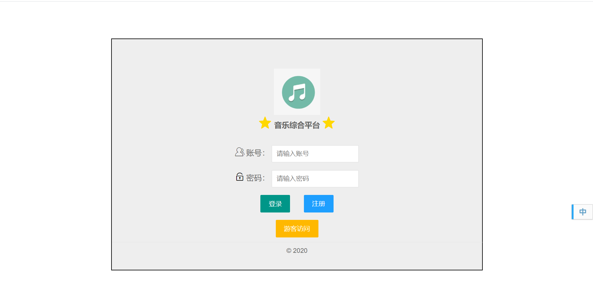
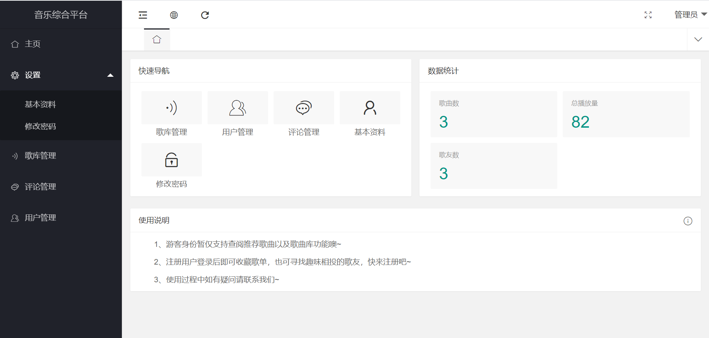
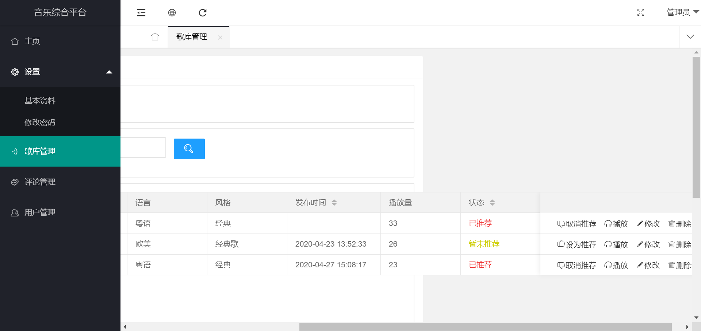
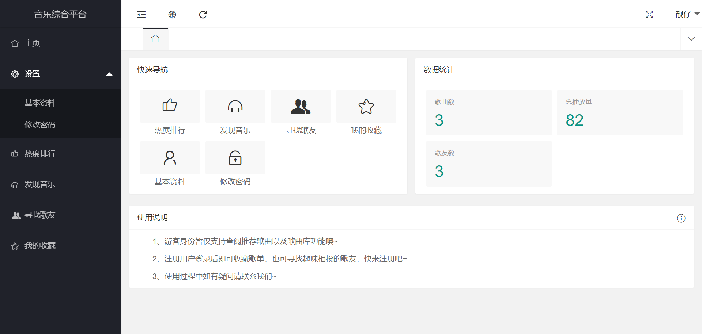
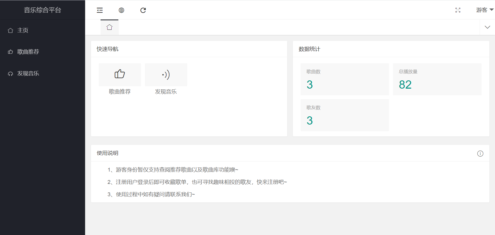
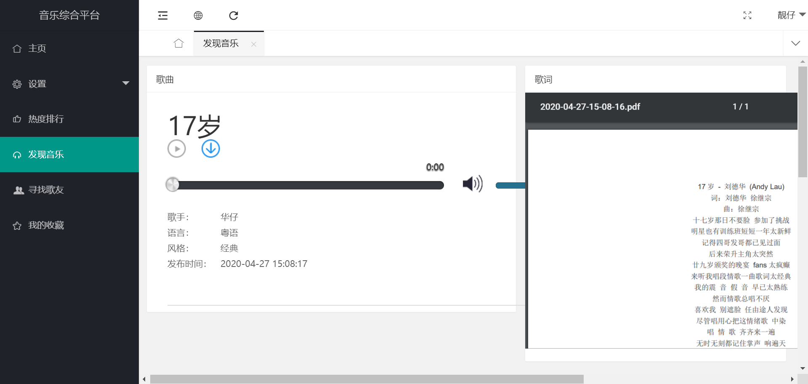

## 音乐综合平台

作者：亚双义一真

时间：2020年4月16日~2020年4月24日

实现功能：在线播放音乐、管理歌库、歌曲评论等功能；三个角色：管理员、用户、游客·

实现技术：LayUI+asp.net MVC+SqlServer+echarts

平台：Visual Studio 2017

---

### 效果截图

- 登录界面

  

- 管理员

  

  

- 用户

  

- 游客

  
  
- 音乐播放界面

  

---

### 备注

1. 数据库已放于项目根目录
2. 用低于2017版本的VS可能无法运行
3. 开发时用的是24寸显示器，截图用的是14寸笔记本，故截图跟实际效果有出入

